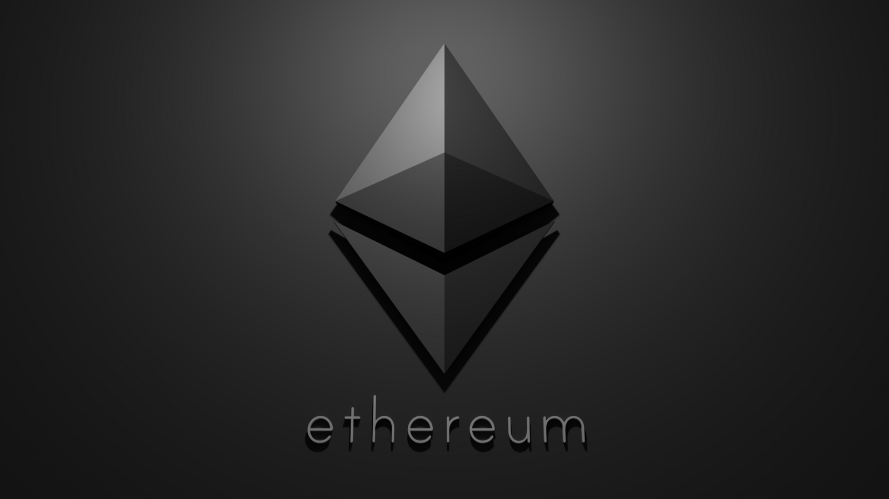
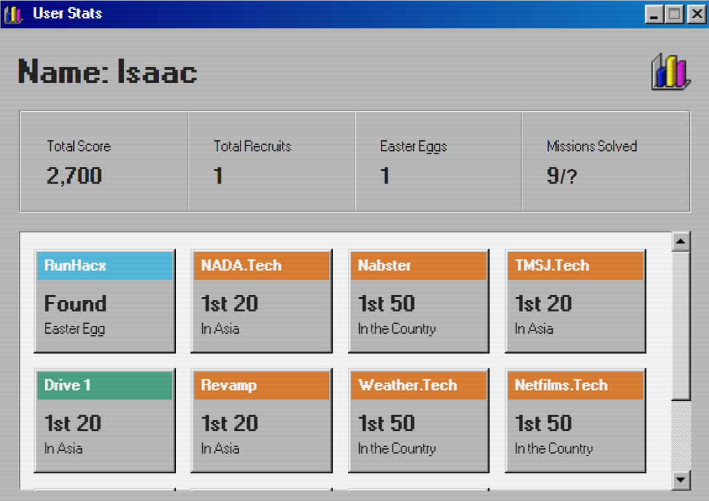

Everything I did during March security related with parts of other elements of my life integrated within the post."

This month I put a halt on most of Web2 stuff I’ve been working on and moved to Web3. Going through tons of Web3 resources to further familiarize myself with the ecosystem.

## Ethereum Ecosystem

Finished reading the [Ethereum Book](https://github.com/ethereumbook/ethereumbook), saw that an [ETH2](https://github.com/smartcontracts/eth2-book) book is also in the making, hoping to contribute to it in the near future, even some translating work would be better than nothing.

## Solidity

Worked on multiple Solidity resources as well, such as freeCodeCamp’s 16 hour Python [tutorial](https://www.youtube.com/watch?v=M576WGiDBdQ&ab_channel=freeCodeCamp.org) on it and most of [CryptoZombies](https://cryptozombies.io/). All my notes on these resources are on my [Github](https://github.com/0xMorph/Blockchain-Notes). I'm still waiting on the Javascript or Typescript version of it coming out since I did most of my deploy scripts in Javascript.

Funny thing about my Github, I actually deleted my old account which had messy notes and leetcode solutions scattered across each repository. Come to think of it, remaking my account was probably a bad idea😅.

I also made a list of CTFs to do on the following weeks, I will post most of the solutions and writeups of them to this blog as well.

Other than Web3 stuff, I also did some XSS CTFs in the [Bounty Hunters](https://discord.gg/bugbounty) server. You can see my name is a few of the HoFs, but I don’t think I would do more in the future as I focus more on Web3. There I also had some fun on OSINT where some members would post random pictures of their environment and we had to find the exact place through Google Earth/Maps, was very fun for sure.

## BreaktheCode

There were fun puzzles and challenges on [BreaktheCode.tech](https://btc2.tech/Fj9sY9), you can participate to win prizes as well. My achievements there were quite good, but a bit inflated since I did them early.

Near the end of the month, I participated in some activities in multiple DAOs, and also listened in to the Immunefi Optimism [talk](https://youtu.be/r6PSmwRGzkU).

How could I forget, I also made a blog to document my progress from now on. The blog will be improved in the next few months when I have more time to maintain it. Maybe once I make it more presentable I could do a tutorial post on it.

## Miscellaneous

Article of the month: [CMichel's How to be a smart contract auditor](https://cmichel.io/how-to-become-a-smart-contract-auditor/)

Song of the month: [Imagine Dragons x J.I.D - Enemy (Heavy Drop Remix)](https://www.youtube.com/watch?v=0_O3ROggUkU&ab_channel=BrutishHeavyMusic)

<iframe width="1383" height="661" src="https://www.youtube.com/embed/0_O3ROggUkU" title="YouTube video player" frameborder="0" allow="accelerometer; autoplay; clipboard-write; encrypted-media; gyroscope; picture-in-picture" allowfullscreen></iframe>

Currently I weigh about 65 Kg, hoping to get to 67 Kg next month, with my dream weight being 75 Kg. Doing this through calistenics and clean bulking would be a challenge.
